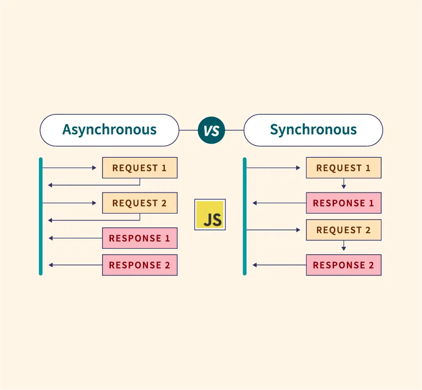

# what is javascript?

JavaScript is a programming language commonly used for web development. It allows developers to add interactivity, dynamic content, and functionality to websites. JavaScript is often used alongside HTML and CSS to create interactive and responsive web pages. It can be executed in web browsers as well as on server-side environments using platforms like Node.js. JavaScript is known for its versatility, as it can be used for front-end development, back-end development, and even mobile app development using frameworks like React Native.

## javascript asynchronous programming



Asynchronous programming in JavaScript allows tasks to be executed concurrently without blocking the main thread. This is crucial for handling operations that take time, such as network requests or reading/writing files, without freezing the user interface. There are several ways to work with asynchronous code in JavaScript:

1. **Callbacks**: Callbacks are functions passed as arguments to another function, to be executed later when the asynchronous operation is complete. Callbacks were one of the earliest ways to handle asynchronous code in JavaScript.

   ```javascript
   function fetchData(callback) {
     setTimeout(() => {
       const data = 'Some data fetched asynchronously';
       callback(data);
     }, 1000);
   }

   fetchData((data) => {
     console.log(data);
   });
   ```

2. **Promises**: Promises were introduced to handle asynchronous code more cleanly and avoid "callback hell." A promise represents the eventual completion or failure of an asynchronous operation and allows chaining operations using `.then()` and `.catch()`.

   ```javascript
   function fetchData() {
     return new Promise((resolve, reject) => {
       setTimeout(() => {
         const data = 'Some data fetched asynchronously';
         resolve(data);
       }, 1000);
     });
   }

   fetchData()
     .then((data) => {
       console.log(data);
     })
     .catch((error) => {
       console.error(error);
     });
   ```

3. **Async/Await**: Async functions and the `await` keyword provide a more readable and concise way to write asynchronous code. An async function returns a promise, and `await` can be used within it to wait for the resolution of another promise without blocking the main thread.

   ```javascript
   async function fetchData() {
     return new Promise((resolve) => {
       setTimeout(() => {
         const data = 'Some data fetched asynchronously';
         resolve(data);
       }, 1000);
     });
   }

   async function processData() {
     try {
       const data = await fetchData();
       console.log(data);
     } catch (error) {
       console.error(error);
     }
   }

   processData();
   ```

Each of these approaches has its advantages and use cases, with async/await being the preferred choice for modern JavaScript development due to its readability and ease of use.

## history of javascript

JavaScript was created by Brendan Eich while he was working at Netscape Communications Corporation in 1995. Initially, it was named "Mocha," but later renamed "LiveScript" before finally settling on "JavaScript" to leverage the popularity of Java at that time. However, despite the name similarity, JavaScript and Java are entirely different languages.

Here's a brief history of JavaScript:

1. **Birth at Netscape**: JavaScript was introduced in September 1995 with Netscape Navigator 2.0. It was created to add dynamic and interactive elements to web pages.

2. **Standardization**: Recognizing the potential of JavaScript beyond Netscape, standardization efforts began. In November 1996, JavaScript was submitted to ECMA International, a European standards organization, resulting in the ECMAScript specification (ECMA-262).

3. **ECMAScript Versions**: ECMAScript defines the standard for JavaScript. Over the years, several versions of ECMAScript have been released, each adding new features and improvements. Major versions include ECMAScript 3 (1999), ECMAScript 5 (2009), ECMAScript 6 (2015, also known as ES2015), ECMAScript 2016, ECMAScript 2017, ECMAScript 2018, ECMAScript 2019, ECMAScript 2020, and ECMAScript 2021. These updates have contributed significantly to the growth and capabilities of JavaScript.

4. **Rise of Libraries and Frameworks**: As web development grew more complex, libraries and frameworks such as jQuery, AngularJS, ReactJS, and Vue.js emerged to simplify and streamline JavaScript development.

5. **Node.js**: In 2009, Ryan Dahl introduced Node.js, a runtime environment that allows JavaScript to run server-side. Node.js contributed to the rise of full-stack JavaScript development, enabling developers to use JavaScript for both client-side and server-side programming.

6. **JavaScript Everywhere**: With the advent of technologies like Electron, developers started using JavaScript for desktop application development. Similarly, with the rise of React Native and other frameworks, JavaScript became a prominent language for mobile app development as well.

7. **ES6 and Beyond**: ECMAScript 6 (ES6) introduced significant enhancements to the language, including classes, arrow functions, template literals, let and const keywords, and more. Subsequent versions continued to refine and expand JavaScript's capabilities.

8. **WebAssembly**: WebAssembly, while not a replacement for JavaScript, offers another option for web development. It allows developers to run code written in languages like C, C++, and Rust on the web at near-native speed, alongside JavaScript.

### JavaScript interpreter

JavaScript has evolved from a simple scripting language for web pages to a versatile and powerful language used for a wide range of applications, from web and mobile development to server-side programming and even game development. Its ubiquity and flexibility have made it one of the most popular programming languages in the world.

A JavaScript interpreter is a program or component that executes JavaScript code. It reads JavaScript code, parses it, and then executes the instructions specified in the code.

There are several types of JavaScript interpreters:

1. **Browser-based Interpreters**: Most web browsers have built-in JavaScript engines that interpret and execute JavaScript code. Examples include:
   - V8 (used in Google Chrome and Node.js)
   - SpiderMonkey (used in Mozilla Firefox)
   - JavaScriptCore (used in Safari)
   - Chakra (used in Microsoft Edge)

2. **Server-side Interpreters**: Node.js is a popular server-side JavaScript runtime environment that includes a built-in JavaScript interpreter. It allows developers to execute JavaScript code on the server, enabling the development of server-side applications using JavaScript.

3. **Stand-alone Interpreters**: There are stand-alone JavaScript interpreters that can be used outside of web browsers or server environments. These interpreters provide command-line interfaces or APIs for executing JavaScript code. Examples include:
   - Rhino: An open-source JavaScript engine written in Java.
   - Duktape: A lightweight JavaScript interpreter primarily designed for embedding in other applications.
   - JerryScript: A lightweight JavaScript engine designed for embedded systems and IoT devices.

4. **Embedded Interpreters**: Some applications embed JavaScript interpreters to allow scripting capabilities. For example, game engines like Unity and Unreal Engine allow developers to write game logic in JavaScript through embedded interpreters.

JavaScript interpreters play a crucial role in executing JavaScript code across various platforms and environments, enabling the development of dynamic and interactive web applications, server-side applications, and more.

## Reference

 <https://developer.mozilla.org/en-US/docs/Learn/Getting_started_with_the_web/JavaScript_basics>
